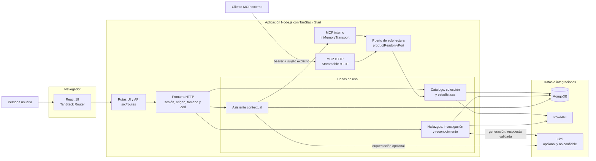

# Pokédex Manager

Aplicación web adaptable para explorar PokéAPI, administrar una colección aislada por cuenta, reconocer cartas con confirmación humana y consultar un asistente contextual basado en herramientas MCP verificables.

La aplicación funciona sin un proveedor de IA para catálogo, colección, estadísticas y asistente local. Kimi es opcional y habilita conversación natural, reconocimiento visual, hallazgos e investigación generativa.

## Demostración

Este recorrido muestra el resumen, el catálogo, la colección, el reconocimiento de cartas, los hallazgos, la investigación y el asistente contextual.


> La grabación reproduce el recorrido completo a velocidad doble para reducir el peso del repositorio.

## Inicio rápido con Docker

Necesitas Docker Engine con Compose. Este flujo crea MongoDB, verifica los índices y arranca la aplicación con valores exclusivos para desarrollo local:

```bash
docker compose up --build
```

Abre `http://localhost:3000`, crea una cuenta y agrega una especie desde **Índice Pokédex**.

Comprueba el estado:

```bash
docker compose ps
curl http://localhost:3000/api/health
```

La respuesta saludable es `{"status":"healthy"}`. Para detener los servicios sin eliminar datos:

```bash
docker compose down
```

El volumen `pokedex-mongo-data` conserva MongoDB. El siguiente comando elimina todos los datos locales y no se debe ejecutar sobre información que necesites conservar:

```bash
docker compose down -v
```

> `docker-compose.yml` es solo para desarrollo. Publica la aplicación con `compose.production.yml`; el archivo local contiene secretos conocidos y no activa autenticación en MongoDB.

## Clonación

Requisitos para trabajar sin Docker:

| Herramienta | Versión mínima |
| --- | --- |
| Node.js | 22.13.0 |
| pnpm | 11.20.0 |
| MongoDB | 7.0 |

Clona el repositorio remoto y entra al proyecto:

```bash
git clone https://github.com/camircode/pokedex-manager.git
cd pokedex_manager
pnpm install --frozen-lockfile
```

El proyecto usa exclusivamente pnpm. `pnpm-lock.yaml` es parte del contrato reproducible y no debe regenerarse con otro gestor.

## Configuración local

Inicia solo MongoDB:

```bash
docker compose up -d mongo
```

Crea `.env.local` a partir de `.env.example` y define al menos:

```dotenv
MONGO_MODE=local
MONGO_URI=mongodb://127.0.0.1:27017
MONGO_DB_NAME=pokedex
BETTER_AUTH_SECRET=reemplazar-con-un-secreto-aleatorio-de-32-caracteres-o-mas
BETTER_AUTH_URL=http://127.0.0.1:3000
```

Genera un secreto adecuado con una fuente criptográfica del sistema, por ejemplo:

```bash
openssl rand -base64 48
```

Inicializa los índices y arranca Vite:

```bash
pnpm db:init
pnpm dev
```

`db:init` es idempotente: crea o verifica 26 índices, nunca elimina documentos y falla si un índice existente contradice el contrato esperado.

## Variables de entorno

| Variable | Obligatoria | Uso |
| --- | --- | --- |
| `MONGO_MODE` | No | `local` por defecto o `atlas` en producción. |
| `MONGO_URI` | Solo local personalizado | URI `mongodb://` usada en modo local. |
| `MONGO_DB_NAME` | No | Nombre de base; valor predeterminado: `pokedex`. |
| `MONGO_ATLAS_OPT_IN` | Sí con Atlas | Debe ser exactamente `true`. Evita conexiones remotas accidentales. |
| `MONGO_ATLAS_URI` | Sí con Atlas | URI base `mongodb+srv://` sin credenciales embebidas. |
| `MONGO_ATLAS_USERNAME` | Sí con Atlas | Usuario de base con privilegios mínimos. |
| `MONGO_ATLAS_PASSWORD` | Sí con Atlas | Contraseña del usuario de base. |
| `BETTER_AUTH_SECRET` | Sí | Secreto de sesión de 32 caracteres como mínimo. |
| `BETTER_AUTH_URL` | Sí fuera de local | URL pública exacta, con HTTPS en producción. |
| `MCP_BEARER_TOKEN` | Solo para MCP HTTP | Bearer independiente de 24 caracteres como mínimo. |
| `MCP_SUBJECT` | Solo para MCP HTTP | ID de Better Auth cuya información privada podrá leer ese bearer. |
| `KIMI_LIVE_ENABLED` | No | Activa Kimi únicamente cuando vale `true`. |
| `MOONSHOT_API_KEY` | Sí con Kimi | Clave privada de Moonshot; nunca llega al cliente. |
| `KIMI_TIMEOUT_MS` | No | Timeout del proveedor; valor predeterminado: `10000`. |
| `MONGO_TEST_URI` | No | URI MongoDB usada por pruebas de integración. |
| `MONGO_TEST_DB_NAME` | No | Base de pruebas cuando una suite no crea un nombre aislado. |

No confirmes `.env`, `.env.local`, `.env.production`, cookies, bearers ni claves de proveedores. `.gitignore` excluye los archivos de entorno salvo `.env.example`.

## Funciones del producto

| Área | Comportamiento |
| --- | --- |
| Autenticación | Registro e inicio de sesión por correo y contraseña mediante Better Auth. Sesiones persistidas en MongoDB. |
| Catálogo | Búsqueda; filtros por tipo, generación, habilidad y categoría Pokédex; autocompletado para listas extensas; orden por generación o cada estadística base; paginación y fichas localizadas desde PokéAPI. Caché de 24 horas con último dato conocido para una ficha vencida. |
| Colección | Alta, edición y eliminación por cuenta; cantidad, apodo, notas, etiquetas y favorito. Todas las consultas incluyen `userId`. |
| Resumen | Especies únicas, cantidad total, favoritos, distribución por tipo y actividad reciente calculados en servidor. |
| Hallazgos | El servidor convierte estadísticas en hechos permitidos; Kimi solo interpreta esos hechos y debe citar sus claves. |
| Investigación | Kimi propone narrativa y objetivos entre candidatos controlados. El servidor valida criterios y calcula el progreso sin escribir durante las lecturas. |
| Reconocimiento | Valida PNG, JPEG o WebP hasta 5 MB, exige consentimiento, consulta Kimi y contrasta ID y nombre con PokéAPI. Nunca agrega sin confirmación. |
| Asistente | Conserva historial por cuenta. Kimi o el modo de respaldo determinista descubren y ejecutan herramientas mediante una sesión MCP oficial en memoria. |
| MCP HTTP | Expone herramientas y recursos de consulta con bearer y sujeto explícitos. No reutiliza la cookie del navegador ni permite escrituras de negocio; una consulta de catálogo puede actualizar la caché técnica. |

## Stack tecnológico

| Área | Tecnologías |
| --- | --- |
| Interfaz | React 19, TanStack Router, React Markdown, GSAP y HackerNoon Pixel Icon Library. |
| Aplicación full stack | TanStack Start, Vite 8, Nitro 3 y Node.js 22. |
| Lenguaje y contratos | TypeScript 6 y Zod 4. |
| Autenticación | Better Auth con adaptador oficial para MongoDB. |
| Persistencia | MongoDB 7 con índices verificados por la aplicación. |
| IA y herramientas | Kimi mediante Moonshot API y Model Context Protocol SDK. |
| Calidad | Vitest 4, Biome 2 y comprobación estática de TypeScript. |
| Operación | pnpm 11, Docker Compose y GitHub Actions. |

## Arquitectura



Las rutas actúan como adaptadores: aplican las políticas HTTP antes de invocar los casos de uso. El asistente y los clientes externos acceden al contexto mediante la misma superficie MCP de solo lectura, por lo que no existe una ruta paralela que evite las reglas del producto. Kimi nunca se considera autoridad; sus salidas pasan por contratos y validaciones de dominio antes de persistirse o mostrarse.

La arquitectura separa transporte, casos de uso e integraciones sin imponer capas vacías:

| Frontera | Responsabilidad |
| --- | --- |
| `src/routes` | UI y manejadores HTTP. Autentican, validan el origen, limitan cuerpos y traducen errores. |
| `src/server` | Casos de uso de catálogo, colección, hallazgos, investigación, reconocimiento y asistente. |
| `src/server/integrations` | Adaptadores para Better Auth, Kimi y MCP. Ningún cliente importa secretos. |
| `src/server/db` | Conexión compartida, definición y verificación de índices MongoDB. |
| `src/lib` | Contratos reutilizables seguros para cliente y servidor, sin acceso a secretos. |
| `tests/unit` | Reglas puras, validaciones y casos límite sin infraestructura. |
| `tests/integration` | Persistencia, autenticación, aislamiento por cuenta y flujos con MongoDB real. |
| `tests/contracts` | Toolchain, Docker, UI, MCP y límites documentales. |

### Funciones principales del código

| Símbolo | Propósito |
| --- | --- |
| `getAuth` | Crea una única instancia de Better Auth y permite recuperarse si la conexión inicial falla. |
| `requireUser` | Convierte una sesión válida en el principal autenticado o produce `401`. |
| `createCatalogService` | Implementa catálogo y caché con dependencias inyectables para pruebas. Reconstruye URLs de especie sobre el origen confiable de PokéAPI. |
| `createCollectionService` | Encapsula escrituras atómicas, aislamiento por cuenta y límites de cantidad de la colección. |
| `addPokemonToCollection` | Obtiene una ficha verificada y delega el alta aislada por usuario. |
| `calculateDashboardStats` | Deriva métricas deterministas sin acceso a infraestructura. |
| `createInsightsService` | Persiste análisis validados por versión de colección. |
| `createResearchService` | Genera expediciones y calcula el estado actual como proyección pura de la colección. |
| `createCardRecognitionService` | Une clasificación Kimi y verificación de catálogo sin persistir la imagen. |
| `createAssistantService` | Aísla conversaciones, limita contexto y operaciones, ejecuta MCP y persiste mensajes citados. |
| `createMcpToolClient` | Negocia una sesión MCP interna, descubre herramientas y conserva el principal autenticado. |
| `createMcpEndpoint` | Implementa MCP Streamable HTTP, sesiones acotadas, origen permitido y autenticación bearer. |
| `productReadonlyPort` | Adapta herramientas MCP a catálogo, colección, estadísticas e investigación. |
| `loadKimiConfig` | Valida activación, clave y timeout sin exponerlos al navegador. |
| `readJsonBody` y `readFormDataBody` | Leen cuerpos como flujo y rechazan el exceso antes de materializarlo por completo. |
| `assertTrustedMutation` | Rechaza mutaciones de navegador cuyo origen no coincide con la aplicación. |
| `consumeEventStream` | Consume SSE y considera error cualquier cierre sin evento terminal. |

Los servicios se crean con una base o un puerto explícito cuando necesitan pruebas aisladas. Los accesores `get...Service` conectan esas mismas reglas a la instancia única de MongoDB en producción.

## Contrato HTTP

| Método y ruta | Acceso | Función |
| --- | --- | --- |
| `GET /api/health` | Público | Disponibilidad de MongoDB. |
| `GET /api/catalog` | Público | Catálogo paginado. |
| `GET /api/pokemon/:id` | Público | Ficha de Pokémon. |
| `GET/POST /api/auth/*` | Público | Rutas administradas por Better Auth. |
| `GET/POST /api/collection` | Sesión | Listar o agregar a la colección. |
| `PATCH/DELETE /api/collection/:id` | Sesión | Editar o eliminar una entrada propia. |
| `GET /api/stats` | Sesión | Métricas de la colección propia. |
| `GET/POST /api/insights` | Sesión | Leer o generar hallazgos. |
| `GET/POST /api/research` | Sesión | Leer o generar investigación. |
| `POST /api/ai/recognize` | Sesión | Reconocer una imagen con consentimiento. |
| `GET/POST /api/assistant` | Sesión | Historial y envío de mensajes. |
| `GET /api/capabilities` | Sesión | Disponibilidad real de Kimi y MCP HTTP. |
| `GET/POST/DELETE /api/mcp` | Bearer MCP | Transporte MCP Streamable HTTP. |

Las respuestas privadas usan `Cache-Control: no-store`. Los errores esperados se traducen a mensajes sanitizados; los detalles de MongoDB, Kimi y secretos no se devuelven al cliente.

## Persistencia

MongoDB almacena:

| Colección | Contenido |
| --- | --- |
| `user`, `session`, `account`, `verification` | Better Auth. |
| `pokemon_cache` | Instantáneas normalizadas de PokéAPI y vencimiento. |
| `collection_entries` | Colección personal con índice único por usuario y Pokémon. |
| `ai_insights` | Interpretaciones validadas por usuario y versión. |
| `research_expeditions` | Expediciones generadas con procedencia. |
| `conversations` | Metadatos de conversaciones por cuenta. |
| `messages` | Mensajes, citas y herramientas ejecutadas. |

La colección personal conserva una instantánea mínima del Pokémon para evitar que una caída temporal de PokéAPI inutilice datos ya registrados. Las métricas y el progreso se derivan de la colección; no son autoridad independiente.

## Kimi y MCP

Kimi se conecta directamente para reconocimiento, hallazgos e investigación. Esas respuestas se consideran no confiables hasta pasar validación Zod y reglas de dominio.

El asistente usa MCP como frontera de contexto. Cada envío crea un cliente y servidor MCP enlazados mediante `InMemoryTransport`, negocia el protocolo, ejecuta `tools/list` y `tools/call`, y cierra la sesión al terminar. El modo local de respaldo usa la misma frontera; no llama servicios de producto por una ruta paralela.

La ruta `/api/mcp` sirve a clientes externos. `MCP_BEARER_TOKEN` se vincula a un único `MCP_SUBJECT`, por lo que el token equivale a acceso de lectura sobre esa cuenta. Debe rotarse si se expone. Las sesiones HTTP viven en memoria, tienen tiempo de vida limitado y no se comparten entre réplicas; un despliegue con varias instancias necesita afinidad de sesión o un rediseño del registro. Las operaciones MCP no modifican datos de negocio, aunque las consultas de PokéAPI pueden renovar `pokemon_cache`.

## Calidad y pruebas

Ejecuta el gate completo:

```bash
pnpm check
pnpm audit:prod
```

O ejecuta cada fase por separado:

```bash
pnpm lint
pnpm format:check
pnpm typecheck
pnpm test
pnpm build
```

Las pruebas de integración requieren MongoDB real en `mongodb://127.0.0.1:27017` salvo que definas `MONGO_TEST_URI`. GitHub Actions levanta MongoDB 7, ejecuta `db:init`, auditoría, lint, formato, tipos, pruebas y build; no omite silenciosamente la persistencia.

## Despliegue remoto

La configuración productiva presupone una máquina Linux con Docker, un dominio, un proxy inverso con TLS y MongoDB Atlas. No publica MongoDB ni incorpora secretos en la imagen.

### 1. Preparar Atlas

1. Crea un proyecto y un clúster de Atlas.
2. Crea un usuario exclusivo para la aplicación con acceso de lectura y escritura solo a la base elegida.
3. Autoriza únicamente la IP de salida del servidor.
4. Conserva la URI `mongodb+srv://` sin usuario ni contraseña; la aplicación codifica las credenciales por separado.
5. Configura copias de seguridad y prueba una restauración antes de aceptar datos reales.

### 2. Crear secretos

Crea `.env.production` fuera del control de versiones:

```dotenv
MONGO_ATLAS_URI=mongodb+srv://cluster.example.mongodb.net/pokedex
MONGO_ATLAS_USERNAME=usuario_aplicacion
MONGO_ATLAS_PASSWORD=contrasena_aleatoria
MONGO_DB_NAME=pokedex
APP_IMAGE=pokedex-manager:version-inmutable
BETTER_AUTH_SECRET=secreto_aleatorio_de_32_caracteres_o_mas
BETTER_AUTH_URL=https://pokedex.example.com
MCP_BEARER_TOKEN=
MCP_SUBJECT=
KIMI_LIVE_ENABLED=false
MOONSHOT_API_KEY=
KIMI_TIMEOUT_MS=10000
```

Deja ambas variables MCP vacías para deshabilitar el acceso HTTP externo. Si activas Kimi, define `KIMI_LIVE_ENABLED=true` y una clave válida.

### 3. Construir y arrancar

```bash
docker compose --env-file .env.production -f compose.production.yml config --quiet
docker compose --env-file .env.production -f compose.production.yml up -d --build
docker compose --env-file .env.production -f compose.production.yml ps
```

El contenedor ejecuta `db:init` antes del servidor. Un contrato de índice incompatible bloquea el arranque en lugar de operar con una base ambigua.

### 4. Publicar por HTTPS

`compose.production.yml` enlaza el puerto a `127.0.0.1:3000`; no queda expuesto directamente. Configura Nginx, Caddy o el balanceador del proveedor para terminar TLS y reenviar al puerto local.

El proxy debe:

- Redirigir HTTP a HTTPS.
- Conservar `Host`, `X-Forwarded-For` y `X-Forwarded-Proto`.
- Desactivar buffering para las rutas SSE del asistente, hallazgos, investigación y reconocimiento.
- Limitar cuerpos a 6 MB como defensa adicional sobre el límite de aplicación.
- Aplicar límites de solicitudes a registro, inicio de sesión y operaciones Kimi.
- Mantener timeouts superiores a `KIMI_TIMEOUT_MS` para no cortar una respuesta válida antes que la aplicación.

Ejemplo mínimo de la ubicación Nginx:

```nginx
location / {
    client_max_body_size 6m;
    proxy_pass http://127.0.0.1:3000;
    proxy_http_version 1.1;
    proxy_set_header Host $host;
    proxy_set_header X-Forwarded-For $proxy_add_x_forwarded_for;
    proxy_set_header X-Forwarded-Proto $scheme;
    proxy_buffering off;
    proxy_read_timeout 60s;
}
```

Los certificados, el bloque `server` y la política de límites de solicitudes dependen del proveedor y deben administrarse fuera del repositorio.

### 5. Verificar el despliegue

```bash
curl --fail https://pokedex.example.com/api/health
curl --fail 'https://pokedex.example.com/api/catalog?page=1&limit=5'
docker compose --env-file .env.production -f compose.production.yml logs --since=10m app
APP_BASE_URL=https://pokedex.example.com pnpm smoke
```

Comprueba además registro, inicio de sesión, aislamiento entre dos cuentas y un flujo SSE. Si Kimi está activo, prueba una operación de bajo costo antes de abrir el servicio al público.

### Actualización y reversión

Antes de actualizar:

1. Crea una copia de seguridad o punto de restauración de Atlas.
2. Revisa cambios de índices y variables.
3. Ejecuta `pnpm check` sobre la revisión que se desplegará.
4. Conserva la imagen o etiqueta anterior.

Asigna a `APP_IMAGE` una etiqueta nueva e inmutable. Construye y actualiza con:

```bash
git pull --ff-only
docker compose --env-file .env.production -f compose.production.yml build
docker compose --env-file .env.production -f compose.production.yml up -d --no-build
```

Para revertir, restaura el valor anterior de `APP_IMAGE` en `.env.production` y ejecuta `up -d --no-build`. Si las imágenes se almacenan en un registro, ejecuta `pull` antes de `up`. `db:init` solo administra índices; una futura migración destructiva de documentos debe incluir su propio procedimiento reversible antes de incorporarse.

## Documentación relacionada

- `PRODUCT.md`: alcance, capacidades y límites confirmados.
- `DESIGN.md`: sistema visual, accesibilidad y movimiento.
- `SECURITY.md`: reporte responsable y alcance de seguridad.
- `openspec/specs`: especificaciones consolidadas.
- `openspec/changes/archive`: decisiones y evidencia histórica de implementación.

## Créditos

La iconografía usa [HackerNoon Pixel Icon Library](https://pixeliconlibrary.com) sin modificaciones. Los iconos se distribuyen bajo [Creative Commons Attribution 4.0 International](https://creativecommons.org/licenses/by/4.0/) (CC BY 4.0) y requieren atribución.

Pokémon y sus nombres pertenecen a sus respectivos titulares. Pokédex Manager es un proyecto independiente y no implica afiliación ni respaldo oficial.

## Licencia

El código propio de Pokédex Manager se distribuye bajo la [GNU Affero General Public License versión 3](LICENSE), identificador SPDX `AGPL-3.0-only`. Si publicas una versión modificada como servicio de red, debes ofrecer a sus usuarios el código fuente correspondiente conforme a la sección 13.

Las dependencias, la iconografía, los nombres de Pokémon y cualquier material de terceros conservan sus propias licencias y derechos.
